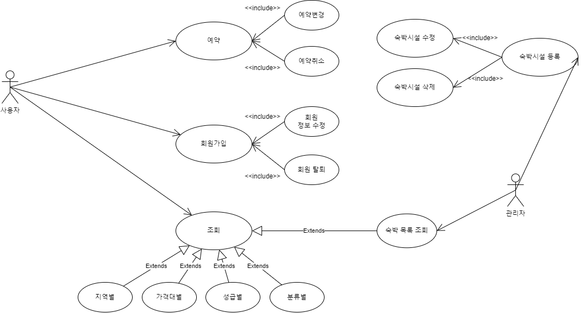
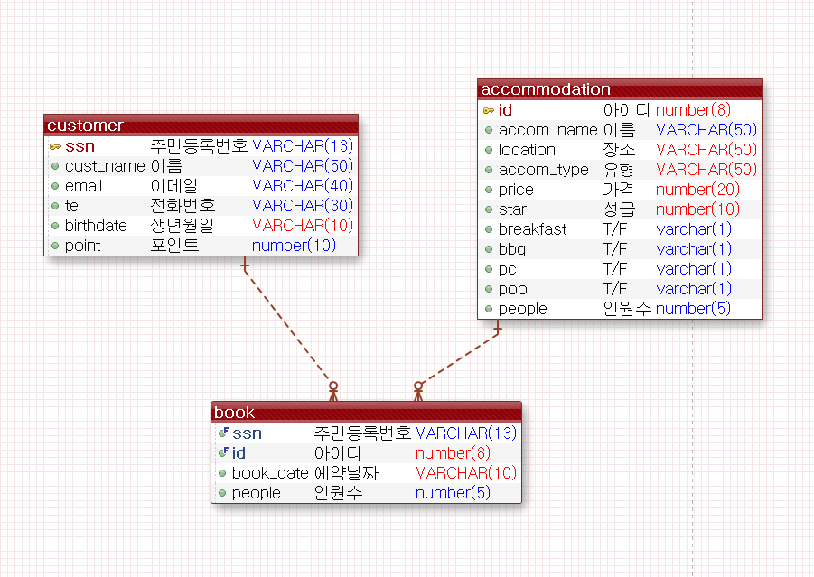
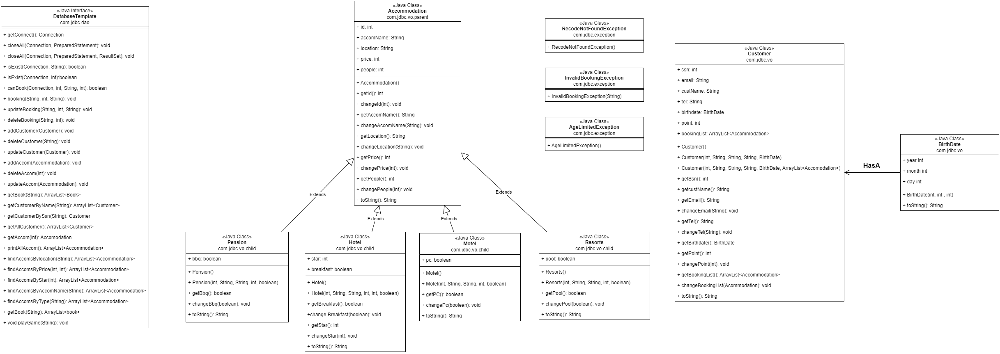
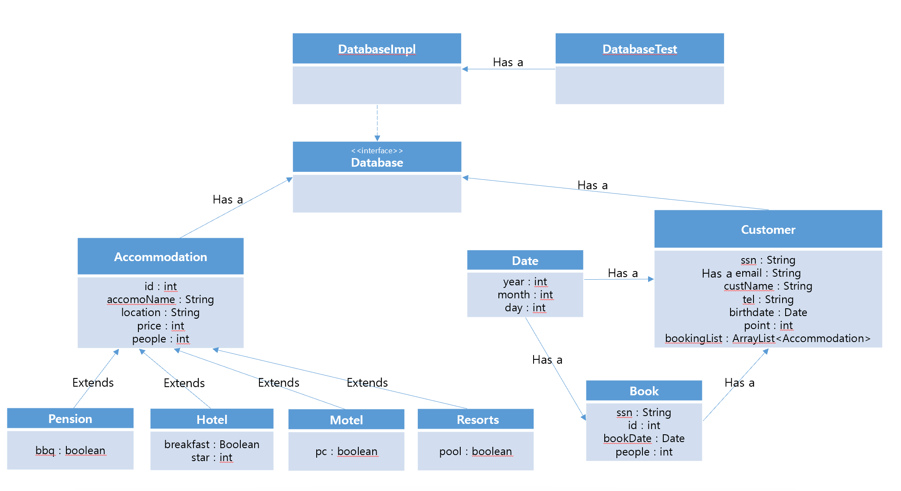
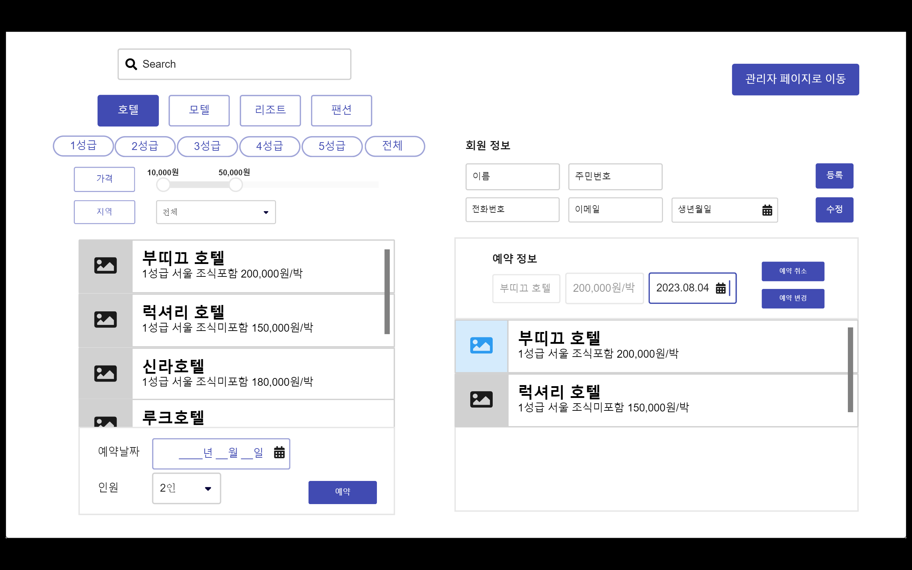
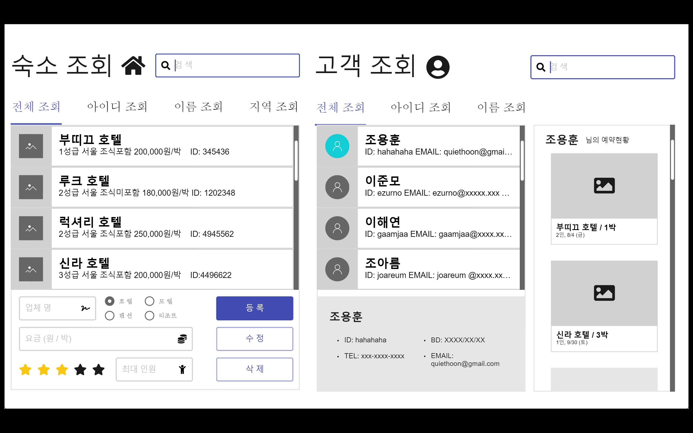

#### Team-Boutique

# 호텔 예약 서비스 구현 🏨

`Back-End` 와 `DB`를 연결해 호텔, 모텔, 리조트 등을 예약하는 서비스

## 0️⃣ 개발 환경

- ORACLE
- SQLDeveloper
- Eclipse
- JAVA 8 버전
- Miro (Front UI 설계 툴)
- Draw.io (Usecase 설계 툴)

## 1️⃣ 팀원 소개

<table>
    <tr>
        <td align="center">
	    <a href="https://github.com/ezurno">
	    	
	    	 
	    	
	    	<b>이준모</b>
	    	 
	    	
	        
	    </a>
	</td>
        <td align="center">
	    <a href="https://github.com/sjsin0905">
	    	
	    	 
	    	
	    	<b>조용훈</b>
	    	 
	    	
	        
	    </a>
	     
	</td>
        <td align="center">
	    <a href="https://github.com/gaamjaa">
	    	
	    	 
	    	
	    	<b>이해연</b>
	    	 
	    	
	        
	    </a>
	     
	</td>
	<td align="center">
	    <a href="https://github.com/joareum">
	    	
	    	 
	    	
	    	<b>조아름</b>
	    	 
	    	
	        
	    </a>
	     
	</td>
</table>

 

## ❌ ~~Usecase Diagram 설계~~

- [Usecase Dirgram 설계 툴](draw.io)
- 해당 설계를 구현하기 위해 Usecase 를 설계

 

 

~~고객은 크게 3가지 `예약, 회원가입, 조회` 에 접근 할 수 있음~~

~~`예약`을 해야만 예약을 `변경`, `취소` 할 수 있기 때문에 예약과 예약 취소, 변경은 **_include 관계_**~~

 

## 2️⃣ Usecase Diagram 재설계

 

 

처음 설계한 usecase-diagram 은 **_문제점이 많았음_**

    - 특정 행동 위주가 아닌 사용자 기준으로 만듦
    - 색상을 사용하지 않아 가시성이 부족했었음
    - `include` 의 방향이 잘못 됐었음

따라서 해당 usecase-diagram 에서의 문제점을 `수정` 후 다시 그림

고객은 파란색, 관리자는 빨간색

고객은 `예약, 회원가입, 조회, 게임하기` 에 접근 할 수 있음

관리자는 `숙박시설 등록, 회원 조회, 목록 조회` 에 접근 할 수 있음

공통으로 접근 할 수 있는 `숙박시설 조회`는 흰색을 적용함

 

## 3️⃣ DB 모델링

 

 

`eXERD` 를 이용해 **DB 모델링**

`Customer` (고객) 와 `Accommodation` (숙소) 는 **서로 다 vs 다 관계** 이므로 각각 `PK` 를 `FK` 로 주어 1 vs 다 구조로 변경해주어야 함

따라서 `Book` (예약) table 을 생성해 비실체화 함

 

## ❌ ~~Class Diagram 구성~~

 

 

~~상단의 **DB 모델링을 이용해 Class Diagram 을 설계** 했음~~

~~각각의 `Hotel`, `Motel`, `Resort`, `Pension` 은 특정한 변수를 갖고 있으며 `Accommodation` 을 상속받음~~

 

## 4️⃣ Class Diagram 재구성

 

 

상단의 **DB 모델링을 이용해 Class Diagram 을 재설계** 했음

처음 설계한 class-diagram 은 **_아쉬운 부분이 있음_**

    - 처음에는 Book 의 class 의 존재 이유를 알지못해 구현하지 않음 (누락)
    - Book이 존재해야하는 이유 (예약번호 등...)
    - method 를 구현 할 필요 없이 큰 틀로만 작성해야했음
    - 색상이 없고 너무 커서 가독성이 떨어짐

Has a 관계와 Extands 관계를 잘 알아볼 수 있게 작성했으며

`Customer` 와 `Date`, `Book` 은 서로서로 **_Hasing 관계_** 에 놓일 수 있도록 설계

`Accommodation` (숙박시설) 은 `Pension` ,`Hotel` 등의 부모 Class 이므로 `extends` 설계

 

## 5️⃣ FE-UI 구현

- FE 기술을 사용하지 않아도 출력화면을 구현을 해야 구조를 이해하기 편함
- 생각치 못한 부분을 떠올릴 수 있음
- 고객과 관리자로 두가지 구현

 

 

상단 바에 숙소 명을 기입해 찾을 수 있음

`호텔`, `모텔`, `리조트`, `팬션` 버튼을 이용해 하단의 `LIST` 에 해당 조건에 맞는 출력 할 수 있음

`가격대별`, `지역별`로 조회 가능

 

특정 호텔을 클릭 후 예약날짜를 기입, 숙박 명수 를 기입 해 예약

 

**우측에는 회원정보 기입란이 있으며 해당 정보를 등록하면 주민등록번호 (SSN) 이 중복되지 않는 이상 해당 고객을 등록**

중복되는 SSN 을 갖고 있을 경우 `Exception` 발생

 

하단에 해당 고객의 예약 정보를 조회 가능, 만약 예약 날짜를 변경할 경우 중단에 날짜 기입을 한 후 수정

 

 

해당 화면은 관리자 탭.

상단의 검색 바에서 **아이디**, **이름**, **지역** 등 카테고리에 일치하는 값을 찾아 리스트에 출력

만약 호텔을 추가할 경우 하단의 업체명과 **Radio-Button** 을 이용해 숙박 시설을 선택, 호텔의 등급을 별모양을 눌러 적용 및 최대 수용가능인원 입력

입력 받은 값으로 등록과 수정이 가능함

 

우측 고객조회 란은 고객 조회를 할 수 있으며 **아이디**, **이름**을 이용해 조회

하단에 **_고객의 상세정보를 조회_** 할 수 있음

맨 **_우측에는 선택 고객의 예약 리스트_** 를 볼 수 있음

