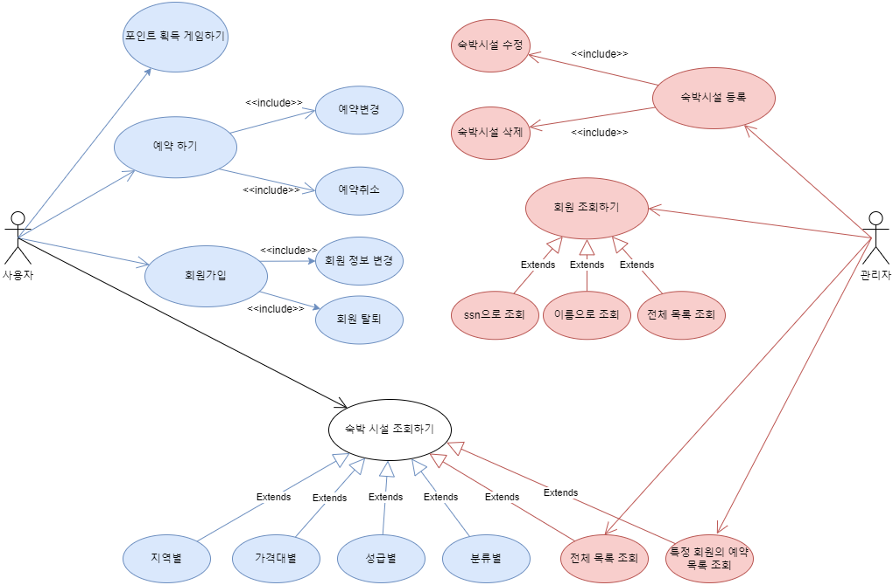
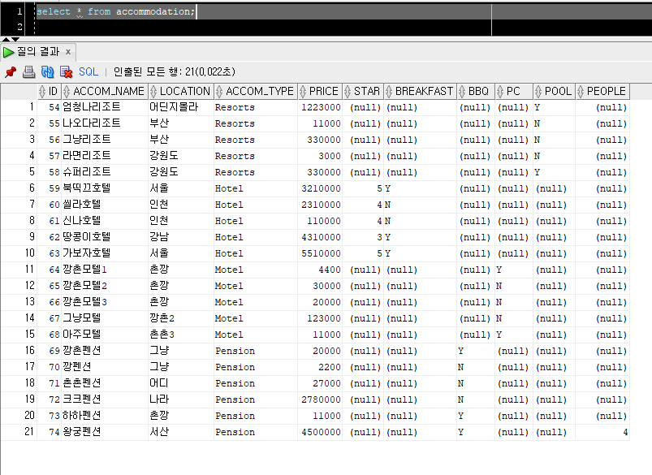
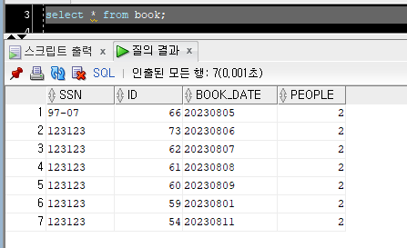
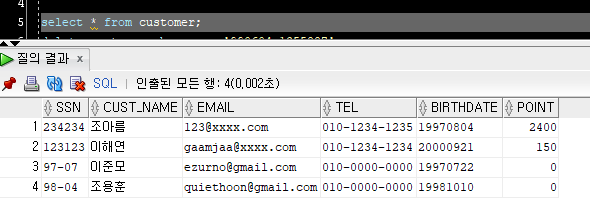
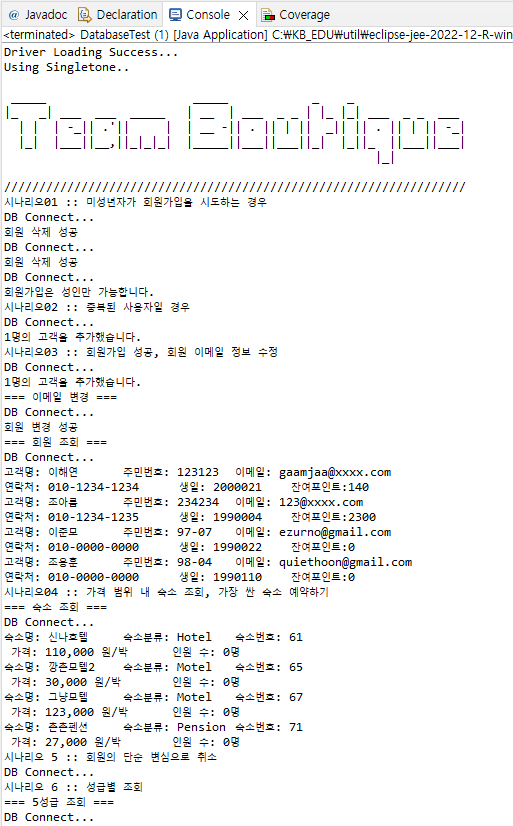
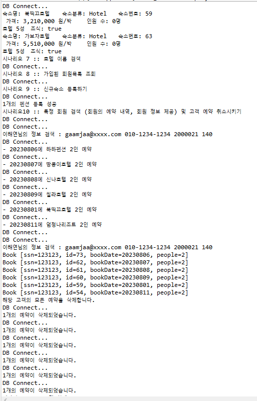
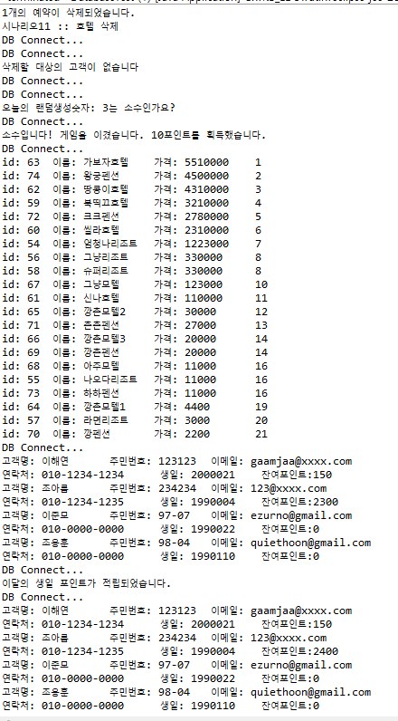
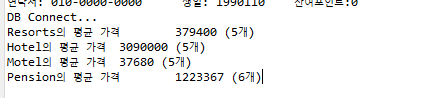

#### Team-Boutique

# 호텔 예약 서비스 구현 🏨

`Back-End` 와 `DB`를 연결해 호텔, 모텔, 리조트 등을 예약하는 서비스

## 0️⃣ 개발 환경

- ORACLE
- SQLDeveloper
- Eclipse
- JAVA 8 버전
- Miro (Front UI 설계 툴)
- Draw.io (Usecase 설계 툴)

## 1️⃣ 팀원 소개

<table>
    <tr>
        <td align="center">
	    <a href="https://github.com/ezurno">
	    	
	    	<br/>
	    	<sub>
	    	<b>이준모</b>
	    	<br/>
	    	
	        </sub>
	    </a>
	</td>
        <td align="center">
	    <a href="https://github.com/sjsin0905">
	    	
	    	<br/>
	    	<sub>
	    	<b>조용훈</b>
	    	<br/>
	    	
	        </sub>
	    </a>
	    <br />
	</td>
        <td align="center">
	    <a href="https://github.com/gaamjaa">
	    	
	    	<br/>
	    	<sub>
	    	<b>이해연</b>
	    	<br/>
	    	
	        </sub>
	    </a>
	    <br />
	</td>
	<td align="center">
	    <a href="https://github.com/joareum">
	    	
	    	<br/>
	    	<sub>
	    	<b>조아름</b>
	    	<br/>
	    	
	        </sub>
	    </a>
	    <br />
	</td>
</table>

<br/>

## ❌ ~~Usecase Diagram 설계~~

- [Usecase Dirgram 설계 툴](draw.io)
- 해당 설계를 구현하기 위해 Usecase 를 설계

<br/>

<br/>

~~고객은 크게 3가지 `예약, 회원가입, 조회` 에 접근 할 수 있음~~

~~`예약`을 해야만 예약을 `변경`, `취소` 할 수 있기 때문에 예약과 예약 취소, 변경은 **_include 관계_**~~

<br/>

## 2️⃣ Usecase Diagram 재설계

<br/>

<br/>

처음 설계한 usecase-diagram 은 **_문제점이 많았음_**

    - 특정 행동 위주가 아닌 사용자 기준으로 만듦
    - 색상을 사용하지 않아 가시성이 부족했었음
    - `include` 의 방향이 잘못 됐었음

따라서 해당 usecase-diagram 에서의 문제점을 `수정` 후 다시 그림

고객은 <span style="color: skyblue">파란색</span>, 관리자는 <span style="color: tomato">빨간색</span>

고객은 `예약, 회원가입, 조회, 게임하기` 에 접근 할 수 있음

관리자는 `숙박시설 등록, 회원 조회, 목록 조회` 에 접근 할 수 있음

공통으로 접근 할 수 있는 `숙박시설 조회`는 흰색을 적용함

<br/>

## 3️⃣ DB 모델링

<br/>

<br/>

`eXERD` 를 이용해 **DB 모델링**

`Customer` (고객) 와 `Accommodation` (숙소) 는 **서로 다 vs 다 관계**

각각 `PK` 를 `FK` 로 주어 1 vs 다 구조로 변경해주어야 함

따라서 `Book` (예약) table 을 생성해 비실체화 함

<br/>

## ❌ ~~Class Diagram 구성~~

<br/>

<br/>

~~상단의 **DB 모델링을 이용해 Class Diagram 을 설계** 했음~~

~~각각의 `Hotel`, `Motel`, `Resort`, `Pension` 은 특정한 변수를 갖고 있으며 `Accommodation` 을 상속받음~~

<br/>

## 4️⃣ Class Diagram 재구성

<br/>

<br/>

상단의 **DB 모델링을 이용해 Class Diagram 을 재설계** 했음

처음 설계한 class-diagram 은 **_아쉬운 부분이 있음_**

    - 처음에는 Book 의 class 의 존재 이유를 알지못해 구현하지 않음 (누락)
    - Book이 존재해야하는 이유 (예약번호 등...)
    - method 를 구현 할 필요 없이 큰 틀로만 작성해야했음
    - 색상이 없고 너무 커서 가독성이 떨어짐

Has a 관계와 Extands 관계를 잘 알아볼 수 있게 작성했으며

`Customer` 와 `Date`, `Book` 은 서로서로 **_Hasing 관계_** 에 놓일 수 있도록 설계

`Accommodation` (숙박시설) 은 `Pension` ,`Hotel` 등의 부모 Class 이므로 `extends` 설계

```JAVA
package com.jdbc.dao;
// 해당 Class Diagram 으로 Implement 설계

import java.sql.Connection;
import java.sql.PreparedStatement;
import java.sql.ResultSet;
import java.sql.SQLException;
import java.util.ArrayList;

import com.jdbc.exception.DuplicateSSNException;
import com.jdbc.exception.InvalidBookingException;
import com.jdbc.exception.RecordNotFoundException;
import com.jdbc.vo.Accommodation;
import com.jdbc.vo.Book;
import com.jdbc.vo.Customer;

public interface DatabaseTemplate {
    //공통 디비 관련 함수
    Connection getConnect() throws SQLException;
    void closeAll(Connection conn, PreparedStatement ps) throws SQLException;
    void closeAll(Connection conn, PreparedStatement ps, ResultSet rs) throws SQLException;

    //ssn과 id로 존재 여부 확인하기
    boolean isExist(Connection conn, String ssn) throws SQLException;
    boolean isExist(Connection conn, int id) throws SQLException;
    boolean isExist(Connection conn, int id, String ssn) throws SQLException;

    //예약 관련
    boolean canBook(Connection conn, int id, String bookDate, int people) throws SQLException, RecordNotFoundException, InvalidBookingException;
    void booking(Book book) throws SQLException, RecordNotFoundException, InvalidBookingException; //void booking(String ssn, int id, String bookDate, int people);
    void updateBooking(Book book) throws SQLException, RecordNotFoundException; //void updateBooking(String ssn, int id, String bookDate);
    void deleteBooking(String ssn, int id) throws SQLException, RecordNotFoundException;

    //고객 관련
    //isExist(String ssn) 먼저
    void addCustomer(Customer customer) throws SQLException, DuplicateSSNException;
    void updateCustomer(Customer customer) throws SQLException, RecordNotFoundException;
    void deleteCustomer(String ssn) throws SQLException, RecordNotFoundException;

    //숙소 관련
    //isExist(int id) 먼저
    void addAccom(Accommodation accom) throws SQLException;
    void updateAccom(Accommodation accom) throws SQLException, RecordNotFoundException;
    void deleteAccom(int id) throws SQLException, RecordNotFoundException;

    //고객 조회 기능
    ArrayList<Book> getBookList(String ssn) throws SQLException;
    ArrayList<Customer> getCustomerByName(String name) throws SQLException;
    Customer getCustomerBySsn(String ssn) throws NumberFormatException, SQLException;
    ArrayList<Customer> getAllCustomer() throws NumberFormatException, SQLException;

    //호텔 조회 기능
    Accommodation getAccom(int id) throws SQLException;
    ArrayList<Accommodation> printAllAccom() throws SQLException;
    ArrayList<Accommodation> findAccomsBylocation(String location) throws SQLException;
    ArrayList<Accommodation> findAccomsByPrice(int s_price, int e_price) throws SQLException;
    ArrayList<Accommodation> findAccomsByStar(int star) throws SQLException;
    ArrayList<Accommodation> findAccomsByAccomName(String name) throws SQLException;
    ArrayList<Accommodation> findAccomsByType(String type) throws SQLException;

    //알고리즘 기능
    void playGame(String ssn) throws SQLException;
}

```

<br/>

## 5️⃣ FE-UI 구현

- FE 기술을 사용하지 않아도 출력화면을 구현을 해야 구조를 이해하기 편함
- 생각치 못한 부분을 떠올릴 수 있음
- 고객과 관리자로 두가지 구현

<br/>

<br/>

상단 바에 숙소 명을 기입해 찾을 수 있음

`호텔`, `모텔`, `리조트`, `팬션` 버튼을 이용해 하단의 `LIST` 에 해당 조건에 맞는 출력 할 수 있음

`가격대별`, `지역별`로 조회 가능

<br/>

특정 호텔을 클릭 후 예약날짜를 기입, 숙박 명수 를 기입 해 예약

<br/>

**우측에는 회원정보 기입란이 있으며 해당 정보를 등록하면 주민등록번호 (SSN) 이 중복되지 않는 이상 해당 고객을 등록**

중복되는 SSN 을 갖고 있을 경우 `Exception` 발생

<br/>

하단에 해당 고객의 예약 정보를 조회 가능, 만약 예약 날짜를 변경할 경우 중단에 날짜 기입을 한 후 수정

<br/>


해당 화면은 `관리자 탭`

상단의 검색 바에서 **아이디**, **이름**, **지역** 등 카테고리에 일치하는 값을 찾아 리스트에 출력

만약 호텔을 추가할 경우 하단의 업체명과 **Radio-Button** 을 이용해 숙박 시설을 선택

호텔의 등급을 별모양을 눌러 적용 및 `최대 수용가능인원 입력`

입력 받은 값으로 등록과 수정이 가능함

<br/>

우측 고객조회 란은 고객 조회를 할 수 있으며 **아이디**, **이름**을 이용해 조회

하단에 **_고객의 상세정보를 조회_** 할 수 있음

맨 **_우측에는 선택 고객의 예약 리스트_** 를 볼 수 있음

<hr/>

## 6️⃣ DB 설정

<br/>

해당 프로젝트 구동을 위해 DB 에 `기본 데이터 세팅`

<p style="display: flex; gap: 5px;">



</p>

좌측부터 `Accommodation`, `Book`, `Customer` Table

각각의 테이블의 형식에 맞게 데이터 값을 입력

<br/>

## 7️⃣ 콘솔결과 확인하기

`미니프로젝트` 이므로 **_Front-UI_** 는 구현❌

따라서 결과값 출력을 **Console** 로 확인

<p style="display: flex; gap:5px;">



<p/>

<br/>

<br/>

각각의 `시나리오`를 구성해 해당 시나리오에 알맞는 값을 **입출력**

<br/>

## 8️⃣ 팀원들의 한마디

<br>
<table>
	<tr>
		<th style="text-align:center">팀 원</th>
		<th style="text-align:center; width: 220px;">좋았던 점</th>
		<th style="text-align:center; width: 220px;">아쉬웠던 점</th>
	<tr/>
	<tr>
		<td align="center">
			<a href="https://github.com/ezurno">
	    	
	    	<br/>
	    	<sub>
	    	<b >이준모</b>
	    	<br/>
            </sub>
        	</a>
    	</td>
    	<td>알고 있는 것과 만들어 본 것은 다르다는 걸 다시금 느끼게 되는 계기가 되었음</td>
    	<td>시간이 많이 부족해서 급하게 만들어 아쉬웠음</td>
    <tr/>
	<tr>
		<td align="center">
			<a href="https://github.com/sjsin0905">
	    	
	    	<br/>
	    	<sub>
	    	<b>조용훈</b>
	    	<br/>
	        </sub>
	    	</a>
    	</td>
    	<td>안녕하세요</td>
    	<td>안녕하세요</td>
    <tr/>
		<tr>
		<td align="center">
	    <a href="https://github.com/gaamjaa">
	    	
	    	<br/>
	    	<sub>
	    	<b>이해연</b>
	    	<br/>
            </sub>
        </a>
    	</td>
    	<td>usecas diagram, class diagram, db modeling, business logic 작성 방법과 그 필요성에 대해서 알 수 있어 좋았다</td>
    	<td>꼼꼼하게 인터페이스를 작성했다고 생각했지만 여기저기서 조금씩 잘못된 부분이 나왔고, 에러가 발생한 부분을 찾는데 오래 걸렸다는 점이 아쉬웠다</td>
    <tr/>
    	<tr>
    	<td align="center">
        <a href="https://github.com/joareum">
        	
        	<br/>
        	<sub>
        	<b>조아름</b>
        	<br/>
            </sub>
        </a>
    	</td>
    	<td>안녕하세요</td>
    	<td>안녕하세요</td>
    <tr/>

</table>
